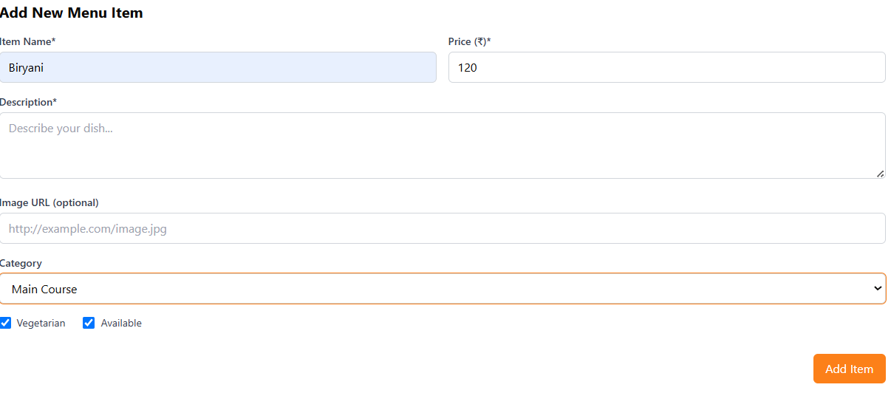
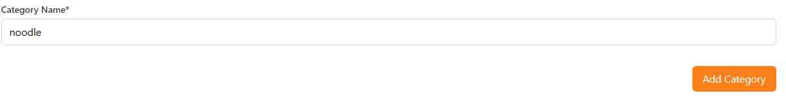

# 🍔 Sparkur Food Delivery 🚀


Welcome to **Sparkur Food Delivery**! A modern, full-stack web application designed to seamlessly connect hungry customers, restaurant admins, and delivery partners. Built using cutting-edge web technologies, it boasts an intuitive UI, real-time tracking, and robust backend services.

---

## ✨ Features

### 👤 For Customers
- 🍕 **Discover Restaurants:** Browse menus, cuisines, and highly-rated restaurants.
- 🛒 **Smart Cart:** Easily add, remove, and manage items before checkout.
- 📦 **Order Tracking:** Real-time updates on your order status (Pending -> Preparing -> Out for Delivery -> Delivered).

### 🏪 For Restaurant Admins
- 📋 **Menu Management:** Add, update, and categorize menu items (Veg/Non-veg flags, Pricing).
- 🛎️ **Order Dashboard:** View incoming orders and update preparation status in real-time.

### 🛵 For Delivery Partners
- 📍 **Delivery Management:** Accept deliveries, navigate to restaurants, and drop off food securely.
- ✅ **Status Updates:** Mark orders as "Out for Delivery" and "Delivered".

---

## 💻 Tech Stack

| Technology | Purpose |
| :--- | :--- |
| **Frontend** | React (v18), Vite, Tailwind CSS, Shadcn UI, Framer Motion |
| **Backend** | Node.js, Express.js |
| **Database** | PostgreSQL (Neon Serverless), Drizzle ORM |
| **Auth** | Passport.js (Local Strategy), Express Sessions |
| **Routing** | Wouter |
| **State Mgt** | React Query (@tanstack/react-query) |

---

## 📸 App Screenshots

Take a look at the amazing UI of the Sparkur application!


<div align="center">
  
  
</div>

---

## 🏗️ Architecture & Flow

Here is a visual representation of how data flows inside Sparkur Food Delivery.

```mermaid
graph TD
    A[🧑 Customer / Admin] -->|HTTP Requests| B(🌐 Vite / React Frontend)
    B <-->|REST API + React Query| C{⚙️ Express Server}
    C <-->|Authentication| D[🔐 Passport.js]
    C <-->|Drizzle ORM| E[(🗄️ Neon PostgreSQL)]
    
    subgraph Core Workflows
    F[Customer Orders] --> G[Order Pending]
    G --> H[Admin Accepts/Prepares]
    H --> I[Ready for Pickup]
    I --> J[Delivery Partner Picks Up]
    J --> K[Delivered]
    end
